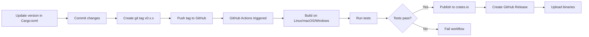

# Publish ctx-snap as a Public CLI Tool

## Overview

Transform ctx-snap into a publicly available CLI tool that users can install via `cargo install ctx-snap`. Set up automated CI/CD to build, test, and publish releases on git tags.

## Prerequisites Checklist

Before publishing to crates.io, you'll need:

1. **crates.io account**: Sign up at [https://crates.io](https://crates.io) using your GitHub account
2. **API token**: Generate at [https://crates.io/me](https://crates.io/me) (needed for automated publishing)
3. **Repository metadata**: Already configured in `[Cargo.toml](Cargo.toml)`

## Implementation Steps

### 1. Add Missing Files

**Create LICENSE file**

The `[Cargo.toml](Cargo.toml)` specifies `license = "MIT"` but no LICENSE file exists. Create `LICENSE` with standard MIT license text including your name and year.

**Update Cargo.toml metadata**

Add repository and homepage URLs to `[Cargo.toml](Cargo.toml)`:

```toml
[package]
name = "ctx-snap"
version = "0.1.0"
edition = "2021"
authors = ["Sathwik Toduru"]
description = "Generate LLM-friendly context snapshots of your codebase"
license = "MIT"
repository = "https://github.com/vedsathwik275/ctx-snap"
homepage = "https://github.com/vedsathwik275/ctx-snap"
readme = "README.md"
keywords = ["cli", "llm", "context", "snapshot", "markdown"]
categories = ["command-line-utilities", "development-tools"]
```

### 2. Set Up GitHub Actions CI/CD

**Create `.github/workflows/ci.yml**`

Automated workflow that:

- Runs on every push and pull request
- Tests on multiple platforms (Linux, macOS, Windows)
- Runs `cargo test`, `cargo clippy`, and `cargo fmt --check`
- Ensures code quality before merging

**Create `.github/workflows/release.yml**`

Automated release workflow that:

- Triggers on version tags (e.g., `v0.1.0`)
- Builds release binaries for Linux, macOS, and Windows
- Runs full test suite
- Publishes to crates.io automatically using `CARGO_REGISTRY_TOKEN` secret
- Creates GitHub Release with pre-built binaries attached
- Generates release notes from git commits

### 3. Configure GitHub Secrets

Add the following secret to your GitHub repository:

- **CARGO_REGISTRY_TOKEN**: Your crates.io API token (Settings → Secrets and variables → Actions → New repository secret)

### 4. Update Documentation

**Enhance README.md**

Update installation section to prioritize crates.io:

```markdown
## Installation

### From crates.io (Recommended)

```bash
cargo install ctx-snap
```

### From source

```bash
git clone https://github.com/vedsathwik275/ctx-snap
cd ctx-snap
cargo install --path .
```

```

Add badges for crates.io version, downloads, and CI status at the top of README.

### 5. Pre-Publication Checklist

Before publishing, verify:

- [ ] `cargo build --release` succeeds ✅ (already verified)
- [ ] `cargo test` passes
- [ ] `cargo clippy -- -D warnings` has no warnings
- [ ] `cargo fmt --check` passes
- [ ] README.md is accurate and complete
- [ ] LICENSE file exists
- [ ] Version number in Cargo.toml is correct (0.1.0 for first release)

### 6. Publishing Process

**First release (manual)**

```bash
# Dry run to check for issues
cargo publish --dry-run

# Publish to crates.io
cargo publish
```

**Subsequent releases (automated)**

1. Update version in `Cargo.toml` (e.g., 0.1.0 → 0.2.0)
2. Commit changes: `git commit -am "Bump version to 0.2.0"`
3. Create and push tag: `git tag v0.2.0 && git push origin v0.2.0`
4. GitHub Actions automatically builds, tests, and publishes

## Release Workflow Diagram




## Post-Publication

After publishing:

1. **Verify installation**: Test `cargo install ctx-snap` on a clean machine
2. **Check crates.io page**: Visit [https://crates.io/crates/ctx-snap](https://crates.io/crates/ctx-snap)
3. **Monitor downloads**: Track adoption via crates.io stats
4. **Respond to issues**: Watch GitHub issues for bug reports and feature requests

## Files to Create/Modify

- Create: `LICENSE`
- Create: `.github/workflows/ci.yml`
- Create: `.github/workflows/release.yml`
- Modify: `[Cargo.toml](Cargo.toml)` (add repository, homepage, readme fields)
- Modify: `[README.md](README.md)` (update installation section, add badges)

## Expected Outcome

Users will be able to install ctx-snap with a single command:

```bash
cargo install ctx-snap
```

Every time you push a version tag, GitHub Actions will automatically:

- Build and test on multiple platforms
- Publish to crates.io
- Create a GitHub Release with downloadable binaries

